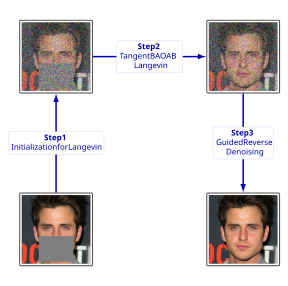

Paste this as your `README.md`.

````markdown
# LCDM: Langevin-Conditioned Diffusion Model

<p align="center">
  <a href="PASTE_PAPER_LINK_HERE"><b>Paper</b></a> |
  <a href="PASTE_ARXIV_LINK_HERE"><b>arXiv</b></a> |
  <a href="PASTE_PROJECT_PAGE_HERE"><b>Project Page</b></a>
</p>

<p align="center">
  
</p>

<p align="center">
  <em>
    LCDM for zero-shot linear inverse problems. The method first builds a noisy constrained state,
    then applies projected Langevin mixing along the tangent space, and finally performs guided reverse denoising.
  </em>
</p>

---

## Overview

This repository contains the official code for **LCDM (Langevin-Conditioned Diffusion Model)**, a zero-shot diffusion framework for linear inverse problems.

We study:

- **Inpainting**
- **8× Super-resolution**

on:

- **CelebA-HQ**
- **LSUN Church**
- **ImageNet**

LCDM combines:

- projection-based conditioning,
- tangent-space Langevin mixing,
- guided reverse denoising.


## Installation

### 1. Create environment

```bash
conda create -n lcdm python=3.10 -y
conda activate lcdm
````

### 2. Install dependencies

```bash
pip install torch torchvision
pip install diffusers accelerate transformers pillow tqdm pyyaml numpy scipy
```

### 3. Make `src/` importable


```bash
export PYTHONPATH=$PWD/src
```

---

## Repository Structure

```text
.
├── configs/
│   ├── celebahq/
│   ├── imagenet/
│   └── lsun_church/
├── scripts/
│   └── run.py
├── src/
│   ├── lcdm/
│   │   ├── datasets/
│   │   ├── models/
│   │   ├── operators/
│   │   ├── samplers/
│   │   ├── registries.py
│   │   ├── runner.py
│   │   └── utils.py
│   ├── models.py
│   ├── script_util.py
│   └── ...
├── assets/
│   └── diffusion-process-overview.png
├── outputs/
└── README.md
```

---

## Configs

All experiments are defined by YAML files under `configs/`.


A typical config looks like this:

```yaml
dataset:
  name: imagenet
  input_dir: image_net/imagenet
  image_size: 256
  file_ext: jpg
  max_images: 1000
  center_crop: true

model:
  name: openai_unet
  checkpoint: 256x256_diffusion_uncond.pt
  use_fp16: true

task:
  name: inpainting

operator:
  name: random_box_mask
  box_h: 100
  box_w: 100
  mask_seed: 2025

sampler:
  name: projected_ddim

warmup:
  name: underdamped
  splitting: baoab
  start_fraction: 0.5
  n_steps: 50
  friction: 0.1
  h_mul: 1.0
  init_noise_std: 0.5

sampling:
  batch_size: 8
  num_inference_steps: 100
  eta: 0.85
  seed: 42

output:
  dir: outputs/imagenet_inpainting_randommask_baoab_100
```

### `dataset`

Controls which images are loaded and how they are preprocessed.

* `dataset.name`: dataset preset (`celebahq`, `imagenet`, `lsun_church`)
* `dataset.input_dir`: path to image folder
* `dataset.image_size`: resize target
* `dataset.file_ext`: file extension (`png`, `jpg`, ...)
* `dataset.max_images`: number of images to process
* `dataset.center_crop`: whether to center-crop before resizing

### `model`

Selects the pretrained diffusion backbone.

* `model.name`

  * `hf_diffusers`
  * `celeba_custom`
  * `openai_unet`
* `model.pretrained_id`: Hugging Face model id for `hf_diffusers`
* `model.checkpoint`: local checkpoint path for `celeba_custom` or `openai_unet`
* `model.use_fp16`: use half precision when supported

### `task`

High-level restoration task.

* `task.name`

  * `inpainting`
  * `superres`

### `operator`

Defines the forward degradation model.

#### Fixed-mask inpainting

```yaml
operator:
  name: mask
  top: 100
  bottom: 0
  left: 0
  right: 100
```

#### Random-mask inpainting

```yaml
operator:
  name: random_box_mask
  box_h: 100
  box_w: 100
  mask_seed: 2025
```

This removes one deterministic random box per image.
If you use the same `mask_seed`, DDNM and LCDM see the **same mask** for the same image.

#### Mean super-resolution

```yaml
operator:
  name: mean_sr
  scale: 8
```

This applies mean downsampling by a factor of 8.

### `sampler`

Selects the reverse-time reconstruction method.

* `sampler.name`

  * `ddnm`
  * `projected_ddim`

Use:

* `ddnm` for the DDNM baseline
* `projected_ddim` for LCDM variants

### `warmup`

Used only for LCDM-style runs.

#### Langevin warmup

```yaml
warmup:
  name: langevin
  start_fraction: 0.5
  n_steps: 50
  h_mul: 1.0
  init_noise_std: 0.5
```

#### Underdamped warmup

```yaml
warmup:
  name: underdamped
  splitting: baoab
  start_fraction: 0.5
  n_steps: 50
  friction: 0.1
  h_mul: 1.0
  init_noise_std: 0.5
```

Fields:

* `warmup.name`

  * `langevin`
  * `underdamped`
* `warmup.splitting`

  * `baoab`
  * `aboab`
* `warmup.start_fraction`: where warmup starts on the diffusion timeline
* `warmup.n_steps`: number of warmup steps
* `warmup.friction`: friction for underdamped dynamics
* `warmup.h_mul`: step-size multiplier
* `warmup.init_noise_std`: initial null-space noise scale

### `sampling`

Controls the reverse diffusion run.

* `sampling.batch_size`: batch size per process
* `sampling.num_inference_steps`: number of DDIM reverse steps
* `sampling.eta`: DDIM stochasticity parameter
* `sampling.seed`: base random seed

### `output`

Controls where generated images are written.

```yaml
output:
  dir: outputs/example_run
```

---

## Quick Start

### Fixed-mask inpainting

```bash
PYTHONPATH=src python scripts/run.py --config configs/celebahq/inpainting_baoab.yaml
PYTHONPATH=src python scripts/run.py --config configs/celebahq/inpainting_ddnm.yaml
```

```bash
PYTHONPATH=src python scripts/run.py --config configs/lsun_church/inpainting_baoab.yaml
PYTHONPATH=src python scripts/run.py --config configs/lsun_church/inpainting_ddnm.yaml
```

```bash
PYTHONPATH=src python scripts/run.py --config configs/imagenet/inpainting_baoab.yaml
PYTHONPATH=src python scripts/run.py --config configs/imagenet/inpainting_ddnm.yaml
```

### Random-mask inpainting

```bash
PYTHONPATH=src python scripts/run.py --config configs/celebahq/inpainting_randommask_baoab_100.yaml
PYTHONPATH=src python scripts/run.py --config configs/celebahq/inpainting_randommask_ddnm_100.yaml
```

```bash
PYTHONPATH=src python scripts/run.py --config configs/lsun_church/inpainting_randommask_baoab_100.yaml
PYTHONPATH=src python scripts/run.py --config configs/lsun_church/inpainting_randommask_ddnm_100.yaml
```

```bash
PYTHONPATH=src python scripts/run.py --config configs/imagenet/inpainting_randommask_baoab_100.yaml
PYTHONPATH=src python scripts/run.py --config configs/imagenet/inpainting_randommask_ddnm_100.yaml
```

### 8× Super-resolution

```bash
PYTHONPATH=src python scripts/run.py --config configs/celebahq/superres_mean_baoab.yaml
PYTHONPATH=src python scripts/run.py --config configs/celebahq/superres_mean_ddnm.yaml
```

```bash
PYTHONPATH=src python scripts/run.py --config configs/lsun_church/superres_mean_baoab.yaml
PYTHONPATH=src python scripts/run.py --config configs/lsun_church/superres_mean_ddnm.yaml
```

```bash
PYTHONPATH=src python scripts/run.py --config configs/imagenet/superres_mean_baoab.yaml
PYTHONPATH=src python scripts/run.py --config configs/imagenet/superres_mean_ddnm.yaml
```

---

## Multi-GPU

Example with 4 GPUs:

```bash
CUDA_VISIBLE_DEVICES=0,1,2,3 PYTHONPATH=src accelerate launch --multi_gpu --num_processes 4 \
  scripts/run.py --config configs/imagenet/inpainting_randommask_baoab_100.yaml
```

---

## Experimental Setup

### Inpainting

* **DDNM:** 100 DDIM steps
* **LCDM:** 50 Langevin steps + 50 DDIM steps
* **Langevin start timestep:** 500

### Super-resolution

* **DDNM:** 100 DDIM steps
* **LCDM:** 50 Langevin steps + 50 DDIM steps
* **Langevin start timestep:** 250

Both are run under a matched **100 NFE** budget.

---


## Citation

```bibtex
@article{yourpaper2025lcdm,
  title   = {Langevin Conditional Diffusion Model for Linear Inverse Problems},
  author  = {Your Name and Coauthors},
  journal = {arXiv preprint arXiv:XXXX.XXXXX},
  year    = {2025}
}
```

---

## Acknowledgements

This repository builds on ideas and code components from:

* Hugging Face Diffusers
* OpenAI Guided Diffusion
* DDNM

```
```
